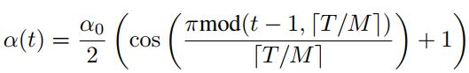
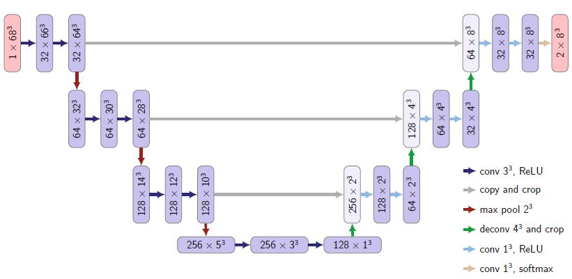
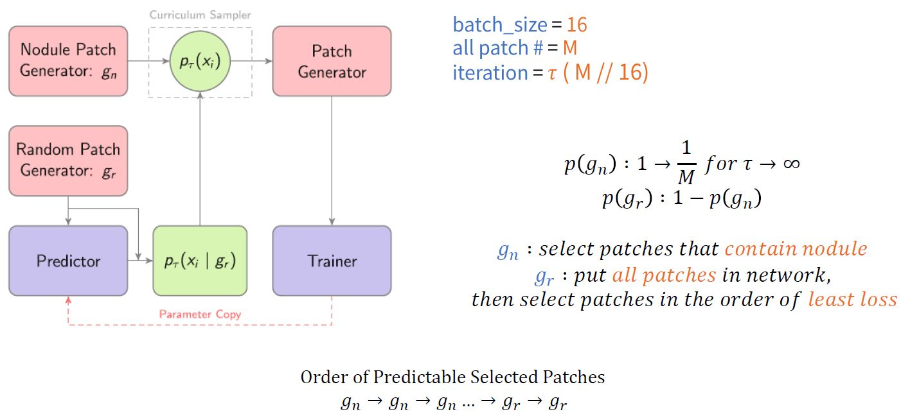
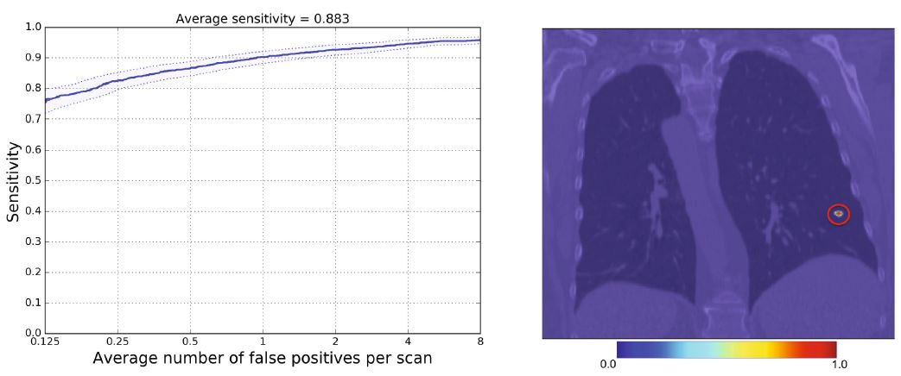

# CASED-Tensorflow
Tensorflow implementation of [Curriculum Adaptive Sampling for Extreme Data Imbalance](https://www.researchgate.net/publication/319461093_CASED_Curriculum_Adaptive_Sampling_for_Extreme_Data_Imbalance) with **multi GPU** using [*LUNA16*](https://luna16.grand-challenge.org/)

## Tutorial
* [Preprocessing_1](https://github.com/taki0112/CASED-Tensorflow/blob/master/Preprocessing_1.md)

## Usage for preprocessing
```python
> python all_in_one.py
```
* Check `src_root` and `save_path`

## Usage for train
```python
> python main_train.py
```
* See `main_train.py` for other arguments.

## Usage for test
```python
> python main_test.py
```

## Issue
* *The hyper-parameter information is not listed in the paper, so I'm still testing it.*
* Use ***[Snapshot Ensemble](https://arxiv.org/pdf/1704.00109.pdf)*** (M=10, init_lr=0.1)
* Or Fix learning rate **0.001**


```python
def Snapshot(t, T, M, alpha_zero) :
    """
    t = # of current iteration
    T = # of total iteration
    M = # of snapshot
    alpha_zero = init learning rate
    """

    x = (np.pi * (t % (T // M))) / (T // M)
    x = np.cos(x) + 1

    lr = (alpha_zero / 2) * x

    return lr
 ```

## Summary
### Preprocessing
* Resample
```bash
> 1.25mm
```

* Hounsfield
```python
> minHU = -1000
> maxHU = 400
```

* Zero centering
```python
> Pixel Mean = 0.25
```

### Network Architecture


### Algorithm


## Result



## Author
Junho Kim / [@Lunit](http://lunit.io/)
